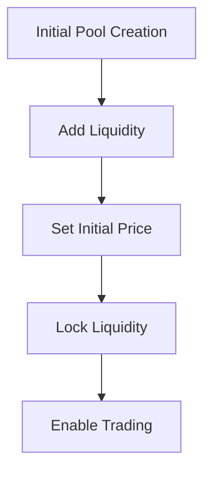
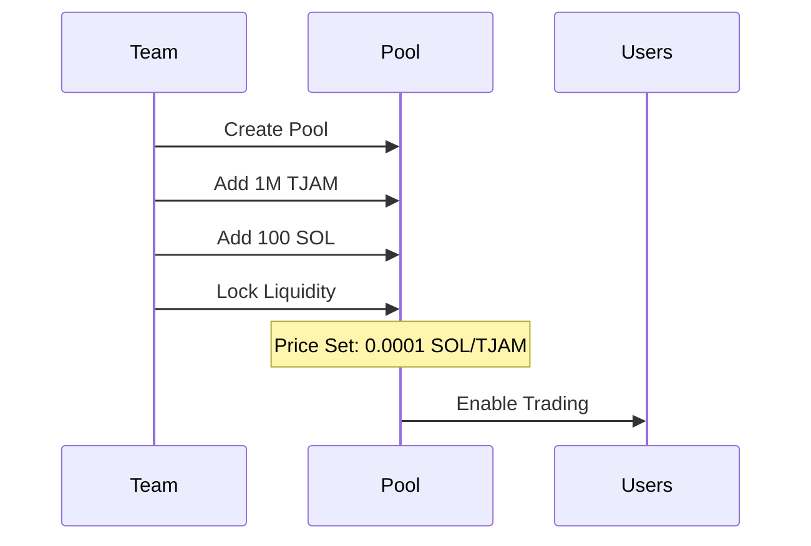

# TJAM Token DEX Listing Plan

## Initial Price Target
- Target Price: 0.0001 SOL per TJAM
- Entry Fee (100 TJAM) = 0.01 SOL
- Initial Market Cap: ~$10,000 (at $100 SOL price)

## Liquidity Pool Setup



### 1. Pool Creation on Raydium
```typescript
interface PoolConfig {
    tokenMint: PublicKey;      // TJAM token mint
    baseToken: PublicKey;      // SOL
    initialPrice: number;      // 0.0001 SOL
    initialLiquidity: {
        tjamAmount: number;    // 1M TJAM
        solAmount: number;     // 100 SOL
    }
}
```

### 2. Price Setting Mathematics
```rust
pub struct LiquidityPool {
    pub tjam_reserves: u64,    // 1,000,000 TJAM
    pub sol_reserves: u64,     // 100 SOL
}

// Price = SOL_reserves / TJAM_reserves
// 0.0001 = 100 / 1,000,000
```

## Implementation Steps

1. **Pre-listing Setup**
```rust
// Create pool account
pub fn create_pool(ctx: Context<CreatePool>) -> Result<()> {
    let pool = &mut ctx.accounts.pool;
    pool.tjam_mint = ctx.accounts.tjam_mint.key();
    pool.sol_mint = ctx.accounts.sol_mint.key();
    pool.authority = ctx.accounts.authority.key();
    Ok(())
}

// Add initial liquidity
pub fn add_initial_liquidity(
    ctx: Context<AddLiquidity>,
    tjam_amount: u64,
    sol_amount: u64,
) -> Result<()> {
    // Transfer tokens to pool
    // Lock liquidity
    // Enable trading
    Ok(())
}
```

2. **Price Protection**
```rust
pub struct PriceProtection {
    pub max_price_impact: u16,    // 5%
    pub min_liquidity: u64,       // Maintain minimum liquidity
    pub cool_down_period: i64,    // Time between large trades
}

pub fn check_price_impact(
    pool: &Pool,
    amount: u64,
    direction: TradeDirection
) -> Result<()> {
    // Calculate price impact
    // Enforce limits
    Ok(())
}
```

3. **Liquidity Lock**
```rust
pub struct LiquidityLock {
    pub unlock_time: i64,         // 1 year from listing
    pub locked_amount: u64,       // Initial liquidity amount
    pub owner: Pubkey,
}

// Time lock liquidity tokens
pub fn lock_liquidity(ctx: Context<LockLiquidity>) -> Result<()> {
    let lock = &mut ctx.accounts.lock;
    lock.unlock_time = Clock::get()?.unix_timestamp + YEAR;
    lock.locked_amount = ctx.accounts.amount;
    Ok(())
}
```

## Trading Launch Sequence



## Price Stability Measures

1. **Initial Trading Limits**
```rust
pub struct TradingLimits {
    pub max_transaction: u64,     // 0.1% of pool
    pub max_wallet: u64,          // 1% of supply
    pub min_hold_time: i64,       // Minimum hold duration
}
```

2. **Anti-Bot Protection**
```rust
pub struct AntiBot {
    pub max_trades_per_block: u8,
    pub max_gas_price: u64,
    pub blacklist: Vec<Pubkey>,
}
```

3. **Volume-Based Restrictions**
```rust
pub fn check_volume_limits(ctx: Context<Trade>) -> Result<()> {
    let volume = get_24h_volume(ctx.accounts.pool);
    require!(
        volume < MAX_DAILY_VOLUME,
        ErrorCode::VolumeLimitExceeded
    );
    Ok(())
}
```

## Post-Listing Monitoring

1. **Price Monitoring**
```typescript
interface PriceMonitor {
    currentPrice: number;
    priceHistory: Array<{
        timestamp: number;
        price: number;
    }>;
    volatility: number;
}
```

2. **Liquidity Health**
```typescript
interface LiquidityHealth {
    totalLiquidity: number;
    depth: number;
    slippage: number;
    healthScore: number;
}
```

3. **Trading Metrics**
```typescript
interface TradingMetrics {
    volume24h: number;
    trades24h: number;
    uniqueTraders: number;
    averageTradeSize: number;
}
```

## Emergency Procedures

1. **Circuit Breakers**
```rust
pub enum EmergencyAction {
    PauseTrades,
    EnableFees,
    AdjustLimits,
    InjectLiquidity,
}
```

2. **Price Defense**
```rust
pub fn defend_price(ctx: Context<DefendPrice>) -> Result<()> {
    let current_price = get_current_price(ctx.accounts.pool);
    if current_price < TARGET_PRICE * 0.95 {
        inject_liquidity(ctx.accounts.pool, DEFENSE_AMOUNT)?;
    }
    Ok(())
}
```

This plan ensures:
1. Controlled initial price
2. Protected liquidity
3. Fair trading environment
4. Price stability
5. Emergency safeguards 