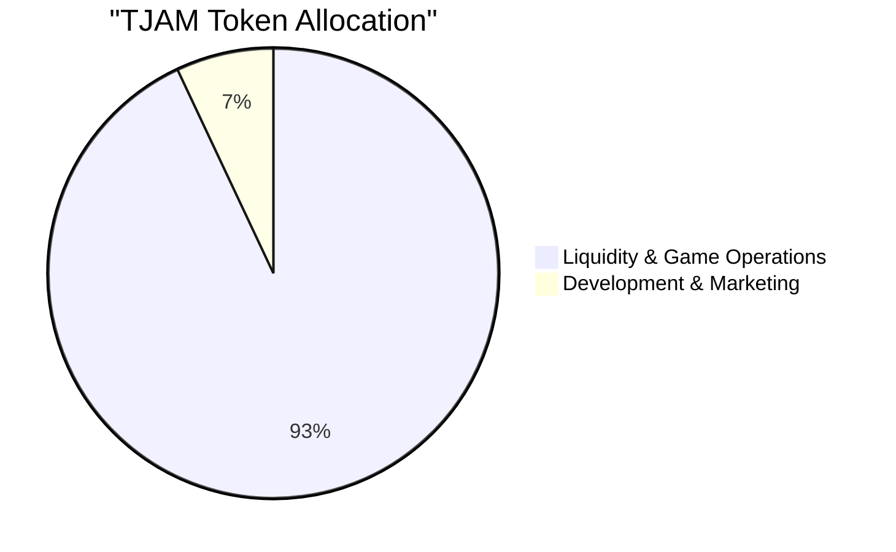

# TJAM Token Structure

## Core Principles
1. Keep it simple ("No Tax, No BS")
2. Community first, speculation second
3. Immediate utility through games
4. Full transparency
5. Fair launch

## Total Supply: 1,000,000,000 TJAM (1B)



### Initial Distribution

1. **Liquidity & Game Operations (93% - 930M TJAM)**
   - Initial DEX Pool: 1M TJAM + 100 SOL
   - Game Prize Pools
   - Future Liquidity
   - All transparent on-chain

2. **Development & Marketing (7% - 70M TJAM)**
   - Locked for 6 months
   - Used for:
     - Development costs
     - Marketing operations
     - Community rewards

## Launch Strategy

### Phase 1: Community Building
- Discord-First Launch
- 500 TJAM airdrop per verified user
- First 1,000 users = 500,000 TJAM total
- Focus on building active player base
- Host community games with no entry fee

### Phase 2: Game Launch
- Entry Fee: 100 TJAM
- Prize Pool Structure:
  - 1st Place: 560 TJAM
  - 2nd Place: 270 TJAM
  - 3rd Place: 110 TJAM
  - Host Fee: 36 TJAM
  - Platform Fee: 24 TJAM

### Phase 3: DEX Launch
- Initial Pool: 1M TJAM + 100 SOL
- Locked liquidity for 1 year
- No team tokens at launch
- Community-driven price discovery

## Implementation

```rust
// Simple token structure
pub struct TjamToken {
    pub total_supply: u64,    // 1B TJAM
    pub decimals: u8,         // 0 decimals
    pub locked_until: i64,    // 1 year timelock
}

// Straightforward game vault
pub struct GameVault {
    pub entry_fee: u64,       // 100 TJAM
    pub prize_pool: u64,      // 1000 TJAM
    pub game_id: Pubkey,
}

// Clean distribution logic
pub struct Distribution {
    pub airdrop_amount: u64,  // 500 TJAM
    pub max_users: u64,       // 1000 initial users
    pub claimed: bool,
}
```

## Key Features

1. **Simplicity**
   - No staking
   - No governance
   - No complicated tokenomics
   - Just play games & win

2. **Fair Launch**
   - No private sale
   - No team tokens at launch
   - Community-first distribution
   - Locked liquidity

3. **Immediate Utility**
   - Play-to-earn games from day one
   - Host to earn opportunities
   - No waiting for utility promises
   - Real usage, not speculation

## Success Metrics

1. **Launch (Month 1)**
   - 1,000 Discord members
   - 500 claimed airdrops
   - 100 games played

2. **Growth (Month 3)**
   - 5,000 token holders
   - Daily game volume: 10,000 TJAM
   - Active DEX trading

3. **Stability (Month 6)**
   - Self-sustaining game economy
   - Organic price discovery
   - Community-driven growth

## Anti-Whale Measures
- Max transaction: 0.1% of supply
- Max wallet: 1% of supply
- Rate limiting on games
- Fair distribution mechanics

## Differences from Other Tokens

1. **vs Traditional Gaming Tokens**
   - No complicated earning mechanics
   - No inflationary rewards
   - Pure gameplay focus

2. **vs Meme Tokens**
   - Real utility from day one
   - Sustainable game economy
   - Fair distribution model

3. **vs "Play-to-Earn" Games**
   - No initial investment required
   - Skill-based rewards
   - Community-first approach

## Smart Contract Simplicity

```rust
// Core functionality only
pub enum TjamInstruction {
    InitializeMint,
    CreateGameVault,
    ProcessGameResults,
    ClaimAirdrop,
}

// Minimal state tracking
pub struct TjamState {
    pub total_games: u64,
    pub active_players: u64,
    pub treasury_balance: u64,
}
```

This structure emphasizes:
1. Simplicity over complexity
2. Community over tokenomics
3. Immediate utility over future promises
4. Fair distribution over private sales
5. Transparency over obscurity