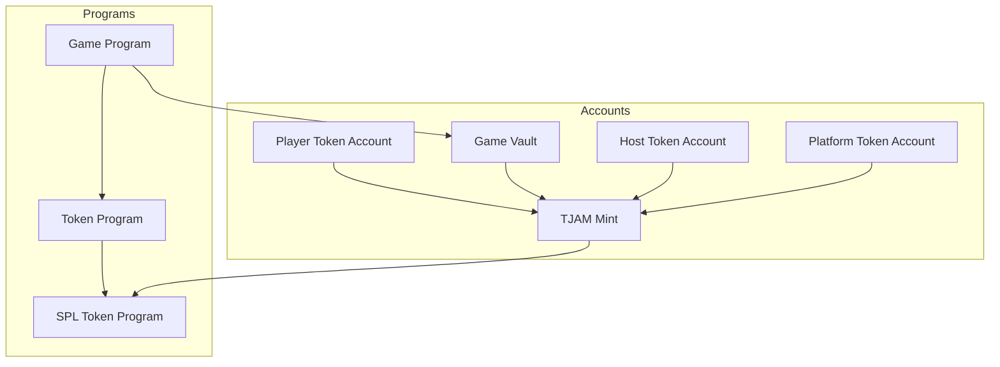
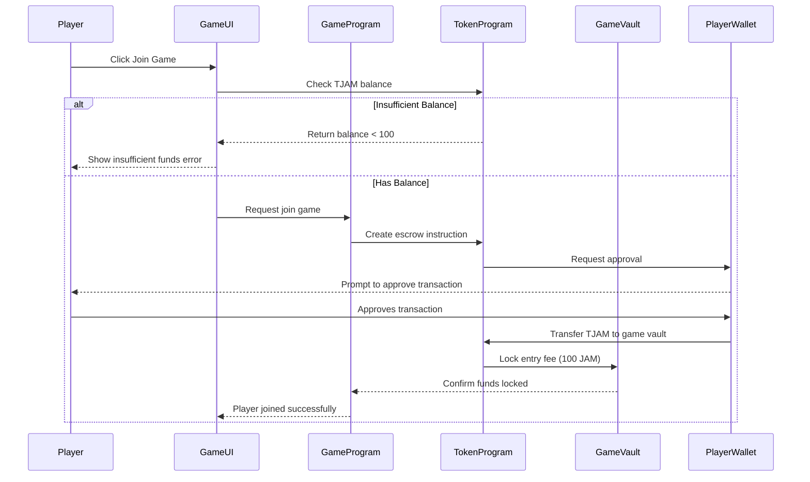
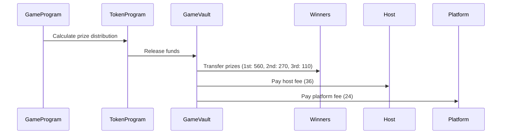
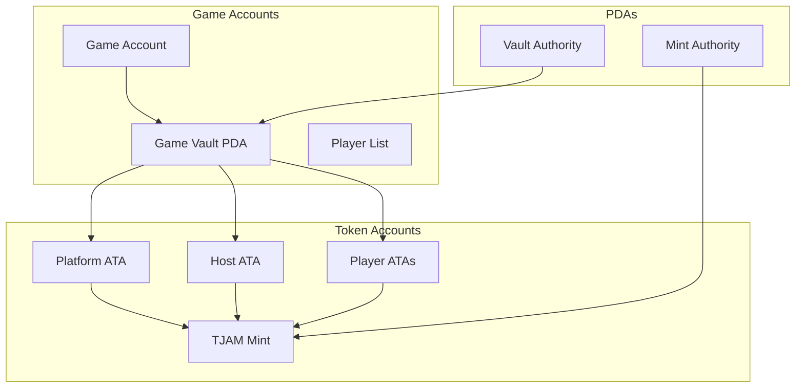
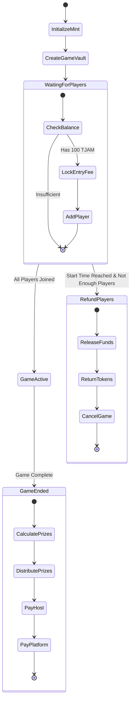
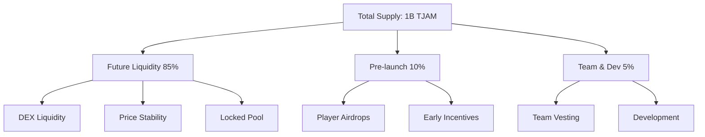
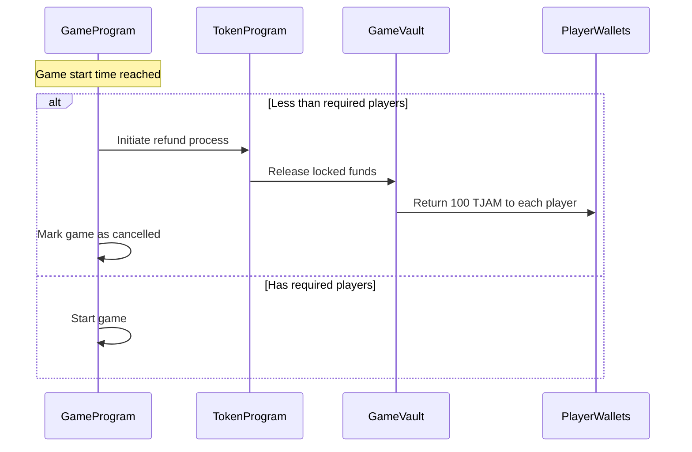
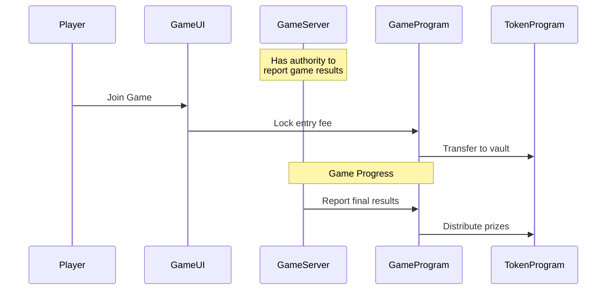
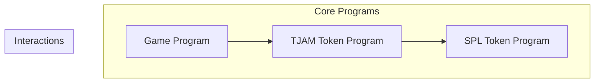
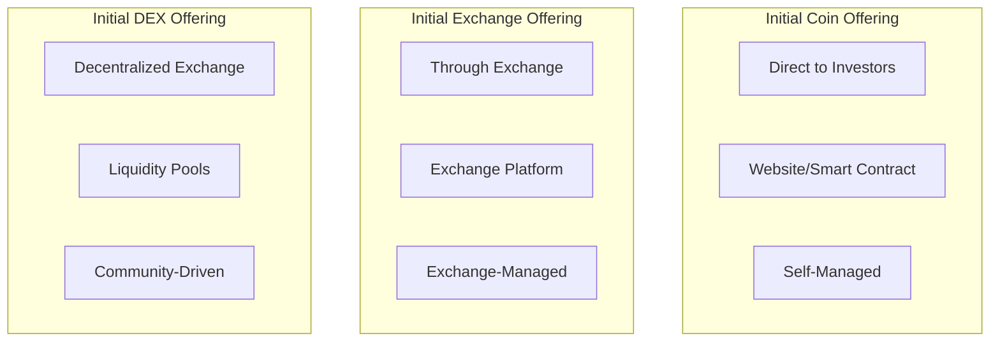

# JAM Token and Game Implementation

## Overview
JAM is a Solana-based SPL token designed specifically for Trivia Jam, enabling players to enter games, win prizes, and hosts to earn rewards.

## Program Architecture



## Entry Fee Flow



## Prize Distribution Flow



## Account Structure



## Program Instructions



## Token Economics

### Initial Supply & Distribution
- Total Supply: 1,000,000,000 TJAM

#### Distribution Breakdown
- 85% - Future Liquidity (850M TJAM)
  - Reserved for market liquidity
  - Initial DEX offering
  - Price stability pool
  - Locked in smart contract with gradual release schedule

- 10% - Pre-launch Operations (100M TJAM)
  - Initial game airdrops for early players
  - Community incentives
  - Marketing tournaments
  - Promotional giveaways

- 5% - Team & Development (50M TJAM)
  - Team allocation (vested over 2 years)
  - Development fund
  - Bug bounty program



### Initial Price Setting Strategy

1. **Initial DEX Offering (IDO)**
   - Start with a small liquidity pool (e.g., 1M TJAM + 100 SOL)
   - Set initial price at 0.1 SOL = 1000 TJAM
   - This makes entry fee (100 TJAM) = 0.01 SOL

2. **Price Stability Measures**
   - Deploy price stability pool with buy/sell limits
   - Implement gradual token release schedule
   - Monitor and adjust liquidity based on demand

### Risks & Mitigations

1. **Price Volatility**
   - Risk: Large holders could dump tokens
   - Mitigation: Vesting schedules, locked liquidity

2. **Initial Distribution**
   - Risk: Too many tokens in circulation too quickly
   - Mitigation: Gradual release schedule, locked pools

3. **Game Economy**
   - Risk: Prize pool manipulation
   - Mitigation: Fixed entry fees, automated prize distribution

4. **Market Making**
   - Risk: Insufficient liquidity
   - Mitigation: Dedicated market making pool, price stability mechanisms

### Launch Phases

1. **Pre-launch (Month 1-2)**
   - Distribute airdrops to early players
   - Host promotional tournaments
   - Build community

2. **IDO (Month 3)**
   - Launch initial liquidity pool
   - Enable token trading
   - Start price stability operations

3. **Growth (Month 4+)**
   - Gradually increase liquidity
   - Release team tokens according to schedule
   - Expand game offerings

## Technical Implementation

### 1. Smart Contract Structure

#### Token Contract (SPL)
- Standard SPL Token implementation
- Fixed supply with no minting capability
- Transfer restrictions during active games
- Automated reward distribution

#### Game Contract
- Handles game creation and player registration
- Manages token entry fee collection and escrow
- Tracks answer submissions and point calculation
- Distributes rewards based on final rankings
- Handles tie-breaking scenarios

### 2. Core Functions

#### Game Management
- createGame(hostPubkey: PublicKey)
- joinGame(playerPubkey: PublicKey)
- startGame(gameId: PublicKey)
- endGameWithResults(gameId: PublicKey, results: GameResults)

#### Token Management
- lockTokens(gameId: PublicKey, amount: number)
- distributeRewards(gameId: PublicKey, rankings: PlayerRanking[])
- handleRefunds(gameId: PublicKey)

### 3. Security Features
- Entry fee escrow system
- Automated instant prize distribution
- Rate limiting on answer submissions
- Multi-signature upgrades
- Emergency pause functionality
- Anti-cheat mechanisms

## Development Task Breakdown

### 1. Token Development
- [ ] Create JAM token contract
  - Implement SPL token standard
  - Set up initial distribution
  - Configure transfer restrictions
- [ ] Build token management system
  - Entry fee handling
  - Prize pool management
  - Escrow functionality

### 2. Game Contract Development
- [ ] Create base game contract
  - Player registration
  - Game state management
  - Token integration
- [ ] Implement scoring system
  - Point calculation
  - Tie-breaking logic
- [ ] Build reward distribution
  - Winner payouts
  - Host compensation
  - Platform fee collection

### 3. React App Integration
- [ ] Add wallet connection
  - Connect to existing session context
  - Handle wallet state management
- [ ] Implement JAM token handling
  - Add to existing host view
  - Update player join flow
  - Show balances/fees in UI
- [ ] Add payout displays
  - Update spectator view with prize amounts
  - Add winner announcements
  - Show host earnings

### 4. Testing & Security
- [ ] Token contract testing
  - Distribution tests
  - Transfer restriction tests
  - Integration tests
- [ ] Game contract testing
  - Game logic tests
  - Reward calculation tests
  - Security checks
- [ ] Performance testing
  - Multi-player scenarios
  - Concurrent games
  - Network latency handling

### 5. Error Handling
- [ ] Smart contract errors
  - Insufficient JAM balance
  - Failed transactions
  - Contract state issues
- [ ] UI error messages
  - Wallet connection
  - Transaction failures
  - Game state errors

## Sample Implementation

### Solana Program (Rust)

```rust
use anchor_lang::prelude::*;
use anchor_spl::token::{self, Token, TokenAccount, Transfer};

#[program]
pub mod trivia_jam {
    use super::*;

    #[state]
    pub struct TriviaGame {
        pub host: Pubkey,
        pub players: Vec<Pubkey>,
        pub entry_fee: u64,
        pub total_pool: u64,
        pub status: GameStatus,
        pub scores: Vec<PlayerScore>,
    }

    #[derive(AnchorSerialize, AnchorDeserialize, Clone, PartialEq)]
    pub enum GameStatus {
        Lobby,
        Active,
        Completed,
    }

    #[derive(AnchorSerialize, AnchorDeserialize, Clone)]
    pub struct PlayerScore {
        pub player: Pubkey,
        pub score: u32,
    }

    #[error_code]
    pub enum GameError {
        GameFull,
        InvalidEntryFee,
        GameNotActive,
        NotAuthorized,
    }

    pub fn initialize_game(
        ctx: Context<InitializeGame>,
        entry_fee: u64,
    ) -> Result<()> {
        let game = &mut ctx.accounts.game;
        game.host = ctx.accounts.host.key();
        game.entry_fee = entry_fee;
        game.status = GameStatus::Lobby;
        Ok(())
    }

    pub fn join_game(ctx: Context<JoinGame>) -> Result<()> {
        let game = &mut ctx.accounts.game;
        if game.players.len() >= 10 {
            return Err(GameError::GameFull.into());
        }

        // Transfer entry fee to game vault
        let transfer_ctx = CpiContext::new(
            ctx.accounts.token_program.to_account_info(),
            Transfer {
                from: ctx.accounts.player_token_account.to_account_info(),
                to: ctx.accounts.game_vault.to_account_info(),
                authority: ctx.accounts.player.to_account_info(),
            },
        );
        token::transfer(transfer_ctx, game.entry_fee)?;

        game.players.push(ctx.accounts.player.key());
        game.total_pool += game.entry_fee;

        Ok(())
    }

    pub fn submit_answer(
        ctx: Context<SubmitAnswer>,
        answer: String,
    ) -> Result<()> {
        // Answer submission logic
        Ok(())
    }

    pub fn distribute_rewards(ctx: Context<DistributeRewards>) -> Result<()> {
        let game = &mut ctx.accounts.game;
        
        // Calculate rewards
        let player_pool = (game.total_pool * 95) / 100;
        let host_reward = (game.total_pool * 4) / 100;
        let platform_fee = (game.total_pool * 1) / 100;

        // Transfer rewards
        // ... implementation
        
        Ok(())
    }
}
```

### TypeScript Client Integration

```typescript
import { 
    Connection, 
    PublicKey, 
    Transaction,
    SystemProgram,
    SYSVAR_RENT_PUBKEY,
} from '@solana/web3.js';
import { 
    Program, 
    Provider,
    web3,
    utils,
    BN,
} from '@project-serum/anchor';
import { TriviaJam } from './types/trivia_jam';

export class TriviaJamClient {
    private program: Program<TriviaJam>;
    private connection: Connection;
    private wallet: any; // Wallet adapter type

    constructor(
        connection: Connection,
        wallet: any,
        programId: PublicKey
    ) {
        this.connection = connection;
        this.wallet = wallet;
        this.program = // Initialize program
    }

    async createGame(entryFee: number): Promise<string> {
        const [gameAccount] = await PublicKey.findProgramAddress(
            [
                Buffer.from("game"),
                this.wallet.publicKey.toBuffer(),
                Buffer.from(utils.bytes.utf8.encode(Date.now().toString()))
            ],
            this.program.programId
        );

        const tx = await this.program.methods
            .initializeGame(new BN(entryFee))
            .accounts({
                game: gameAccount,
                host: this.wallet.publicKey,
                systemProgram: SystemProgram.programId,
                rent: SYSVAR_RENT_PUBKEY,
            })
            .rpc();

        return gameAccount.toString();
    }

    async joinGame(
        gameId: string,
        playerTokenAccount: PublicKey
    ): Promise<string> {
        const gameAccount = new PublicKey(gameId);
        const gameVault = await this.getGameVault(gameAccount);

        const tx = await this.program.methods
            .joinGame()
            .accounts({
                game: gameAccount,
                player: this.wallet.publicKey,
                playerTokenAccount,
                gameVault,
                tokenProgram: TOKEN_PROGRAM_ID,
            })
            .rpc();

        return tx;
    }

    async submitAnswer(
        gameId: string,
        answer: string
    ): Promise<string> {
        const gameAccount = new PublicKey(gameId);

        const tx = await this.program.methods
            .submitAnswer(answer)
            .accounts({
                game: gameAccount,
                player: this.wallet.publicKey,
            })
            .rpc();

        return tx;
    }

    // React component integration example
    static useGame(gameId: string) {
        const [gameState, setGameState] = useState<GameState | null>(null);
        
        useEffect(() => {
            if (!gameId) return;
            
            // Subscribe to game account changes
            const gameAccount = new PublicKey(gameId);
            const subscription = program.account.game.subscribe(
                gameAccount,
                'confirmed',
                (account) => {
                    setGameState(account);
                }
            );

            return () => {
                program.account.game.unsubscribe(subscription);
            };
        }, [gameId]);

        return gameState;
    }
}

// Example usage in React component
function GameView({ gameId }: { gameId: string }) {
    const wallet = useWallet();
    const gameState = TriviaJamClient.useGame(gameId);
    const client = useMemo(() => 
        new TriviaJamClient(connection, wallet, PROGRAM_ID),
        [connection, wallet]
    );

    const handleJoinGame = async () => {
        try {
            await client.joinGame(gameId, playerTokenAccount);
        } catch (error) {
            console.error('Failed to join game:', error);
        }
    };

    // Render game UI
}
```

## Game Timeout/Refund Flow



## Program Instructions


## Game Server Architecture



### Game Authority Design

```rust
// Game Program State
pub struct Game {
    pub id: Pubkey,
    pub host: Pubkey,
    pub game_authority: Pubkey,  // Server key that can report results
    pub vault: Pubkey,
    pub status: GameStatus,
    // ... other fields
}

// Create game with server authority
pub fn create_game(ctx: Context<CreateGame>, server_key: Pubkey) -> Result<()> {
    let game = &mut ctx.accounts.game;
    game.host = ctx.accounts.host.key();
    game.game_authority = server_key;  // Store server's key
    
    // Create vault PDA with both host and server as authorities
    let (vault_key, _) = Pubkey::find_program_address(
        &[
            b"vault",
            game.key().as_ref(),
            game.host.as_ref(),
            game.game_authority.as_ref()
        ],
        ctx.program_id
    );
    game.vault = vault_key;
    
    Ok(())
}

// Only game server can report results
pub fn report_game_results(
    ctx: Context<ReportResults>,
    rankings: Vec<(Pubkey, u8)>
) -> Result<()> {
    let game = &ctx.accounts.game;
    
    // Verify caller is the game authority
    require!(
        ctx.accounts.authority.key() == game.game_authority,
        GameError::InvalidAuthority
    );
    
    // Process results and distribute prizes
    distribute_prizes(ctx, rankings)?;
    
    Ok(())
}

#[derive(Accounts)]
pub struct ReportResults<'info> {
    #[account(
        mut,
        constraint = game.game_authority == authority.key()
    )]
    pub game: Account<'info, Game>,
    pub authority: Signer<'info>,
    // ... other accounts
}
```

### Server Key Management

```typescript
// On game server
class GameServer {
    private serverKeypair: Keypair;
    
    async createGame(hostPubkey: PublicKey): Promise<PublicKey> {
        // Create game with server as authority
        const tx = await program.methods
            .createGame(this.serverKeypair.publicKey)
            .accounts({
                host: hostPubkey,
                // ... other accounts
            })
            .rpc();
            
        return tx;
    }
    
    async reportGameResults(
        gameId: PublicKey,
        rankings: Array<[PublicKey, number]>
    ) {
        // Sign and submit results
        const tx = await program.methods
            .reportGameResults(rankings)
            .accounts({
                game: gameId,
                authority: this.serverKeypair.publicKey,
                // ... other accounts
            })
            .signers([this.serverKeypair])
            .rpc();
            
        return tx;
    }
}
```

### Security Considerations

1. **Server Key Protection**
   - Server's private key must be securely stored
   - Consider using HSM for production
   - Rotate keys periodically

2. **Authority Verification**
   - Game program verifies server signature
   - Host cannot manipulate results
   - Players cannot forge outcomes

3. **Result Reporting**
   - Only authorized server can submit results
   - Results are final once submitted
   - Transparent prize distribution

4. **Failure Recovery**
   - Server maintains game state backup
   - Can recover from interrupted games
   - Emergency refund mechanism

## Programs & Data Structures

### 1. Programs


#### A. TJAM Token Program
- Manages TJAM token lifecycle
- Handles token accounts
- Controls token transfers
- Manages game vaults

```rust
pub struct TjamTokenProgram {
    pub mint: Pubkey,
    pub mint_authority: Pubkey,
    pub supply: u64,
    pub decimals: u8,
}

pub enum TjamTokenInstruction {
    InitializeMint,
    CreateTokenAccount,
    LockTokens,
    ReleaseTokens,
    TransferTokens,
}
```

#### B. Game Program
- Manages game lifecycle
- Handles player registration
- Controls game state
- Distributes prizes

```rust
pub struct GameProgram {
    pub game_authority: Pubkey,
    pub vault_authority: Pubkey,
    pub settings: GameSettings,
}

pub enum GameInstruction {
    CreateGame,
    JoinGame,
    StartGame,
    EndGame,
    DistributePrizes,
}
```

### 2. Accounts

#### A. Token Accounts
```rust
pub struct TokenAccount {
    pub mint: Pubkey,
    pub owner: Pubkey,
    pub amount: u64,
    pub delegate: Option<Pubkey>,
    pub state: AccountState,
    pub is_native: bool,
    pub delegated_amount: u64,
    pub close_authority: Option<Pubkey>,
}
```

#### B. Game Accounts
```rust
pub struct Game {
    pub id: Pubkey,
    pub host: Pubkey,
    pub game_authority: Pubkey,
    pub vault: Pubkey,
    pub status: GameStatus,
    pub players: Vec<Player>,
    pub settings: GameSettings,
    pub prize_distribution: PrizeDistribution,
    pub start_time: i64,
    pub end_time: Option<i64>,
}

pub struct GameVault {
    pub game_id: Pubkey,
    pub authority: Pubkey,
    pub token_account: Pubkey,
    pub locked_amount: u64,
}

pub struct Player {
    pub id: Pubkey,
    pub token_account: Pubkey,
    pub score: u32,
    pub paid: bool,
}
```

#### C. Program Derived Addresses (PDAs)
```rust
// Game Vault PDA
[
    b"vault",
    game_id.as_ref(),
    game_authority.as_ref()
]

// Token Account PDA
[
    b"token",
    owner.as_ref(),
    mint.as_ref()
]
```

### 3. State & Settings

#### A. Game Settings
```rust
pub struct GameSettings {
    pub min_players: u8,
    pub max_players: u8,
    pub entry_fee: u64,
    pub question_count: u8,
}
```

#### B. Prize Distribution
```rust
pub struct PrizeDistribution {
    pub first_place: u64,   // 560 TJAM
    pub second_place: u64,  // 270 TJAM
    pub third_place: u64,   // 110 TJAM
    pub host_fee: u64,      // 36 TJAM
    pub platform_fee: u64,  // 24 TJAM
}
```

#### C. Game Status
```rust
pub enum GameStatus {
    Created,
    Lobby,
    Active,
    Finished,
    Cancelled
}
```

### 4. Cross-Program Invocations (CPIs)

```rust
// Game Program -> Token Program
pub struct LockTokensCPI<'info> {
    pub game: Account<'info, Game>,
    pub player: Account<'info, TokenAccount>,
    pub vault: Account<'info, TokenAccount>,
    pub token_program: Program<'info, Token>,
}

// Token Program -> SPL Token Program
pub struct TransferTokensCPI<'info> {
    pub from: Account<'info, TokenAccount>,
    pub to: Account<'info, TokenAccount>,
    pub authority: Signer<'info>,
    pub token_program: Program<'info, Token>,
}
```

### 5. Error Types

```rust
pub enum GameError {
    InvalidGameState,
    GameFull,
    InsufficientPlayers,
    InvalidEntryFee,
    AlreadyPaid,
    GameNotEnded,
    InvalidAuthority,
}

pub enum TokenError {
    InsufficientBalance,
    InvalidAmount,
    InvalidAuthority,
    AccountFrozen,
    AccountNotFound,
}
```

### 6. Events

```rust
pub enum GameEvent {
    GameCreated { game_id: Pubkey, host: Pubkey },
    PlayerJoined { game_id: Pubkey, player: Pubkey },
    GameStarted { game_id: Pubkey },
    GameEnded { game_id: Pubkey, winner: Pubkey },
    PrizesDistributed { game_id: Pubkey, distributions: Vec<(Pubkey, u64)> },
}

pub enum TokenEvent {
    TokensLocked { game_id: Pubkey, amount: u64 },
    TokensReleased { game_id: Pubkey, amount: u64 },
    TokensTransferred { from: Pubkey, to: Pubkey, amount: u64 },
}
```

## Token Launch Comparison

### Launch Methods Comparison



### 1. Initial Coin Offering (ICO)
- **Structure**: Direct token sale to investors
- **Platform**: Custom website/smart contract
- **Management**: Self-managed by project team
- **Pros**:
  - Complete control over process
  - No platform fees
  - Larger potential investor base
- **Cons**:
  - Higher marketing costs
  - Security risks
  - Less credibility
  - More regulatory scrutiny

### 2. Initial Exchange Offering (IEO)
- **Structure**: Token sale through centralized exchange
- **Platform**: Established exchanges (e.g., Binance Launchpad)
- **Management**: Exchange-managed
- **Pros**:
  - Built-in user base
  - Exchange credibility
  - Easier marketing
  - Better security
- **Cons**:
  - High platform fees
  - Exchange requirements
  - Less control
  - Limited to exchange users

### 3. Initial DEX Offering (IDO) ✅
- **Structure**: Token sale through DEX liquidity pools
- **Platform**: Decentralized exchanges (e.g., Raydium)
- **Management**: Community-driven
- **Pros**:
  - Immediate liquidity
  - Lower costs
  - Fair distribution
  - Decentralized nature
- **Cons**:
  - More complex setup
  - Potential for price volatility
  - Requires liquidity management

### Recommendation for TJAM

We recommend the **IDO approach** for TJAM token launch for these reasons:

1. **Alignment with Solana Ecosystem**
   - Native integration with Solana DEXs
   - Strong Solana DEX community
   - Lower gas fees for trading

2. **Fair Launch Mechanics**
   ```rust
   pub struct IdoConfig {
       pub initial_supply: u64,      // 1B TJAM
       pub initial_price: u64,       // 0.1 SOL = 1000 TJAM
       pub min_pool_size: u64,       // Minimum liquidity requirement
       pub max_allocation: u64,      // Maximum per wallet
       pub vesting_schedule: VestingSchedule,
   }
   ```

3. **Liquidity Pool Structure**
   ```rust
   pub struct LiquidityPool {
       pub tjam_amount: u64,         // TJAM in pool
       pub sol_amount: u64,          // SOL in pool
       pub initial_price: u64,       // Starting price
       pub pool_tokens: u64,         // LP tokens
       pub fee_tier: u16,            // Trading fee %
   }
   ```

4. **Launch Process**
   ```mermaid
   sequenceDiagram
       participant Team
       participant DEX
       participant Users
       
       Team->>DEX: Create Liquidity Pool
       Team->>DEX: Add Initial Liquidity
       Note over Team,DEX: Lock liquidity for 1 year
       DEX->>Users: Open Trading
       Note over Users: Fair Price Discovery
       Users->>DEX: Provide Additional Liquidity
   ```

5. **Price Protection Mechanisms**
   ```rust
   pub struct PriceProtection {
       pub max_price_impact: u16,    // Max price change per trade
       pub circuit_breaker: u16,     // Halt if price moves too fast
       pub liquidity_limits: u64,    // Min liquidity requirements
   }
   ```

### Implementation Plan

1. **Pre-Launch Phase**
   - Create TJAM token
   - Set up vesting contracts
   - Prepare liquidity pool contract

2. **IDO Setup**
   - Deploy on Raydium
   - Initial pool: 1M TJAM + 100 SOL
   - Set initial price: 0.1 SOL = 1000 TJAM

3. **Launch Sequence**
   ```rust
   pub enum LaunchPhase {
       Setup {
           pool_creation: bool,
           initial_liquidity: bool,
       },
       PreLaunch {
           whitelist: bool,
           announcements: bool,
       },
       Launch {
           trading_enabled: bool,
           price_protection: bool,
       },
       PostLaunch {
           monitoring: bool,
           stabilization: bool,
       },
   }
   ```

4. **Post-Launch Management**
   - Monitor liquidity levels
   - Implement price stability measures
   - Begin vesting schedules
   - Enable game integration


### Market Cap Evolution
1. **Month 1-3 (Discord Phase)**
   - Circulating: 1.5M TJAM
   - Price: $0.01
   - Market Cap: $15,000

2. **Month 6 (Post-IDO)**
   - Circulating: ~52M TJAM
   - Additional Released:
     - Treasury: 50M (25%)
     - Team: 0 (still in cliff)
   - Market Cap: $520,000 (at initial price)

3. **Month 12**
   - Circulating: ~152M TJAM
     - Treasury: 100M (50%)
     - Team: 25M (50%)
     - Initial: 27M
   - Market Cap: $1.52M (at initial price)

4. **Month 24 (Full Vesting)**
   - Circulating: 300M TJAM
   - Market Cap: $3M (at initial price)