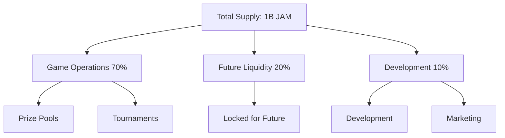
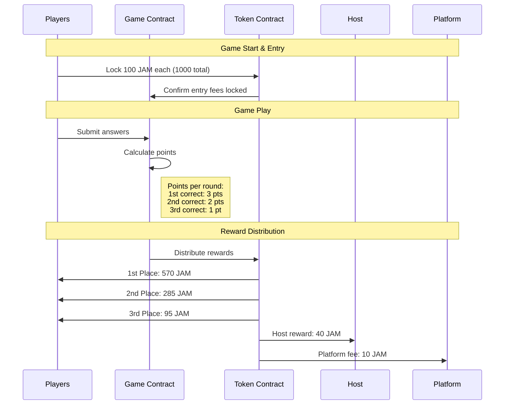

# JAM Token and Game Implementation

## Overview
JAM is a Solana-based SPL token designed specifically for Trivia Jam, enabling players to enter games, win prizes, and hosts to earn rewards.

## Token Economics

### Initial Supply & Distribution
- Total Supply: 1,000,000,000 JAM

#### Distribution Breakdown
- 70% - Game Operations (700M JAM)
  - Initial game prize pools
  - Tournament prize pools
  - Community airdrops

- 20% - Future Liquidity Pool (200M JAM)
  - Reserved for future exchange listings
  - Will enable token trading when ecosystem matures
  - Locked until 1000+ active players reached

- 10% - Development & Growth (100M JAM)
  - Platform development
  - Marketing initiatives
  - Bug bounties



### Game Economics

#### Standard Game Format
- Fixed 10-player games
- Entry Fee: 100 JAM tokens per player
- Total Game Pool: 1000 JAM per game

#### Scoring System
- Points per correct answer:
  - First correct: 3 points
  - Second correct: 2 points
  - Third correct: 1 point

#### Payout Structure
For each 1000 JAM game pool:
- Player Prize Pool (95% = 950 JAM)
  - First Place: 570 JAM (60% of prize pool)
  - Second Place: 285 JAM (30% of prize pool)
  - Third Place: 95 JAM (10% of prize pool)
- Host Reward: 40 JAM (4% of total pool)
- Platform Fee: 10 JAM (1% of total pool)



### Liquidity Pool Timeline

#### Prerequisites for Pool Launch
1. Active User Base
   - At least 1000 active players
   - Consistent daily game volume
   - Stable token velocity

2. Token Distribution Metrics
   - 25%+ of tokens in circulation
   - At least 500 unique token holders
   - Natural trading demand emerging

3. Market Indicators
   - Regular host payouts being used
   - Players requesting token purchases
   - Community-driven price discovery

#### Implementation Phases

1. **Pre-Pool Phase (Current)**
   - Direct token distribution
   - Manual host settlements
   - No public trading

2. **Preparation Phase** (When prerequisites met)
   - Lock 200M JAM in pool contract
   - Set initial JAM/SOL price
   - Establish pool parameters

3. **Initial Pool Launch**
   - Start with small liquidity
   - Monitor trading patterns
   - Adjust parameters based on usage

4. **Scale Pool Size**
   - Gradually increase liquidity
   - Add trading pairs if needed
   - Implement price stability measures

## Technical Implementation

### 1. Smart Contract Structure

#### Token Contract (SPL)
- Standard SPL Token implementation
- Fixed supply with no minting capability
- Transfer restrictions during active games
- Automated reward distribution

#### Game Contract
- Handles game creation and player registration
- Manages token entry fee collection and escrow
- Tracks answer submissions and point calculation
- Distributes rewards based on final rankings
- Handles tie-breaking scenarios

### 2. Core Functions

#### Game Management
- createGame(hostPubkey: PublicKey)
- joinGame(playerPubkey: PublicKey)
- startGame(gameId: PublicKey)
- endGameWithResults(gameId: PublicKey, results: GameResults)

#### Token Management
- lockTokens(gameId: PublicKey, amount: number)
- distributeRewards(gameId: PublicKey, rankings: PlayerRanking[])
- handleRefunds(gameId: PublicKey)

### 3. Security Features
- Entry fee escrow system
- Automated instant prize distribution
- Rate limiting on answer submissions
- Multi-signature upgrades
- Emergency pause functionality
- Anti-cheat mechanisms

## Development Task Breakdown

### 1. Token Development
- [ ] Create JAM token contract
  - Implement SPL token standard
  - Set up initial distribution
  - Configure transfer restrictions
- [ ] Build token management system
  - Entry fee handling
  - Prize pool management
  - Escrow functionality

### 2. Game Contract Development
- [ ] Create base game contract
  - Player registration
  - Game state management
  - Token integration
- [ ] Implement scoring system
  - Point calculation
  - Tie-breaking logic
- [ ] Build reward distribution
  - Winner payouts
  - Host compensation
  - Platform fee collection

### 3. React App Integration
- [ ] Add wallet connection
  - Connect to existing session context
  - Handle wallet state management
- [ ] Implement JAM token handling
  - Add to existing host view
  - Update player join flow
  - Show balances/fees in UI
- [ ] Add payout displays
  - Update spectator view with prize amounts
  - Add winner announcements
  - Show host earnings

### 4. Testing & Security
- [ ] Token contract testing
  - Distribution tests
  - Transfer restriction tests
  - Integration tests
- [ ] Game contract testing
  - Game logic tests
  - Reward calculation tests
  - Security checks
- [ ] Performance testing
  - Multi-player scenarios
  - Concurrent games
  - Network latency handling

### 5. Error Handling
- [ ] Smart contract errors
  - Insufficient JAM balance
  - Failed transactions
  - Contract state issues
- [ ] UI error messages
  - Wallet connection
  - Transaction failures
  - Game state errors

## Sample Implementation

### Solana Program (Rust)

```rust
use anchor_lang::prelude::*;
use anchor_spl::token::{self, Token, TokenAccount, Transfer};

#[program]
pub mod trivia_jam {
    use super::*;

    #[state]
    pub struct TriviaGame {
        pub host: Pubkey,
        pub players: Vec<Pubkey>,
        pub entry_fee: u64,
        pub total_pool: u64,
        pub status: GameStatus,
        pub scores: Vec<PlayerScore>,
    }

    #[derive(AnchorSerialize, AnchorDeserialize, Clone, PartialEq)]
    pub enum GameStatus {
        Lobby,
        Active,
        Completed,
    }

    #[derive(AnchorSerialize, AnchorDeserialize, Clone)]
    pub struct PlayerScore {
        pub player: Pubkey,
        pub score: u32,
    }

    #[error_code]
    pub enum GameError {
        GameFull,
        InvalidEntryFee,
        GameNotActive,
        NotAuthorized,
    }

    pub fn initialize_game(
        ctx: Context<InitializeGame>,
        entry_fee: u64,
    ) -> Result<()> {
        let game = &mut ctx.accounts.game;
        game.host = ctx.accounts.host.key();
        game.entry_fee = entry_fee;
        game.status = GameStatus::Lobby;
        Ok(())
    }

    pub fn join_game(ctx: Context<JoinGame>) -> Result<()> {
        let game = &mut ctx.accounts.game;
        if game.players.len() >= 10 {
            return Err(GameError::GameFull.into());
        }

        // Transfer entry fee to game vault
        let transfer_ctx = CpiContext::new(
            ctx.accounts.token_program.to_account_info(),
            Transfer {
                from: ctx.accounts.player_token_account.to_account_info(),
                to: ctx.accounts.game_vault.to_account_info(),
                authority: ctx.accounts.player.to_account_info(),
            },
        );
        token::transfer(transfer_ctx, game.entry_fee)?;

        game.players.push(ctx.accounts.player.key());
        game.total_pool += game.entry_fee;

        Ok(())
    }

    pub fn submit_answer(
        ctx: Context<SubmitAnswer>,
        answer: String,
    ) -> Result<()> {
        // Answer submission logic
        Ok(())
    }

    pub fn distribute_rewards(ctx: Context<DistributeRewards>) -> Result<()> {
        let game = &mut ctx.accounts.game;
        
        // Calculate rewards
        let player_pool = (game.total_pool * 95) / 100;
        let host_reward = (game.total_pool * 4) / 100;
        let platform_fee = (game.total_pool * 1) / 100;

        // Transfer rewards
        // ... implementation
        
        Ok(())
    }
}
```

### TypeScript Client Integration

```typescript
import { 
    Connection, 
    PublicKey, 
    Transaction,
    SystemProgram,
    SYSVAR_RENT_PUBKEY,
} from '@solana/web3.js';
import { 
    Program, 
    Provider,
    web3,
    utils,
    BN,
} from '@project-serum/anchor';
import { TriviaJam } from './types/trivia_jam';

export class TriviaJamClient {
    private program: Program<TriviaJam>;
    private connection: Connection;
    private wallet: any; // Wallet adapter type

    constructor(
        connection: Connection,
        wallet: any,
        programId: PublicKey
    ) {
        this.connection = connection;
        this.wallet = wallet;
        this.program = // Initialize program
    }

    async createGame(entryFee: number): Promise<string> {
        const [gameAccount] = await PublicKey.findProgramAddress(
            [
                Buffer.from("game"),
                this.wallet.publicKey.toBuffer(),
                Buffer.from(utils.bytes.utf8.encode(Date.now().toString()))
            ],
            this.program.programId
        );

        const tx = await this.program.methods
            .initializeGame(new BN(entryFee))
            .accounts({
                game: gameAccount,
                host: this.wallet.publicKey,
                systemProgram: SystemProgram.programId,
                rent: SYSVAR_RENT_PUBKEY,
            })
            .rpc();

        return gameAccount.toString();
    }

    async joinGame(
        gameId: string,
        playerTokenAccount: PublicKey
    ): Promise<string> {
        const gameAccount = new PublicKey(gameId);
        const gameVault = await this.getGameVault(gameAccount);

        const tx = await this.program.methods
            .joinGame()
            .accounts({
                game: gameAccount,
                player: this.wallet.publicKey,
                playerTokenAccount,
                gameVault,
                tokenProgram: TOKEN_PROGRAM_ID,
            })
            .rpc();

        return tx;
    }

    async submitAnswer(
        gameId: string,
        answer: string
    ): Promise<string> {
        const gameAccount = new PublicKey(gameId);

        const tx = await this.program.methods
            .submitAnswer(answer)
            .accounts({
                game: gameAccount,
                player: this.wallet.publicKey,
            })
            .rpc();

        return tx;
    }

    // React component integration example
    static useGame(gameId: string) {
        const [gameState, setGameState] = useState<GameState | null>(null);
        
        useEffect(() => {
            if (!gameId) return;
            
            // Subscribe to game account changes
            const gameAccount = new PublicKey(gameId);
            const subscription = program.account.game.subscribe(
                gameAccount,
                'confirmed',
                (account) => {
                    setGameState(account);
                }
            );

            return () => {
                program.account.game.unsubscribe(subscription);
            };
        }, [gameId]);

        return gameState;
    }
}

// Example usage in React component
function GameView({ gameId }: { gameId: string }) {
    const wallet = useWallet();
    const gameState = TriviaJamClient.useGame(gameId);
    const client = useMemo(() => 
        new TriviaJamClient(connection, wallet, PROGRAM_ID),
        [connection, wallet]
    );

    const handleJoinGame = async () => {
        try {
            await client.joinGame(gameId, playerTokenAccount);
        } catch (error) {
            console.error('Failed to join game:', error);
        }
    };

    // Render game UI
}
```